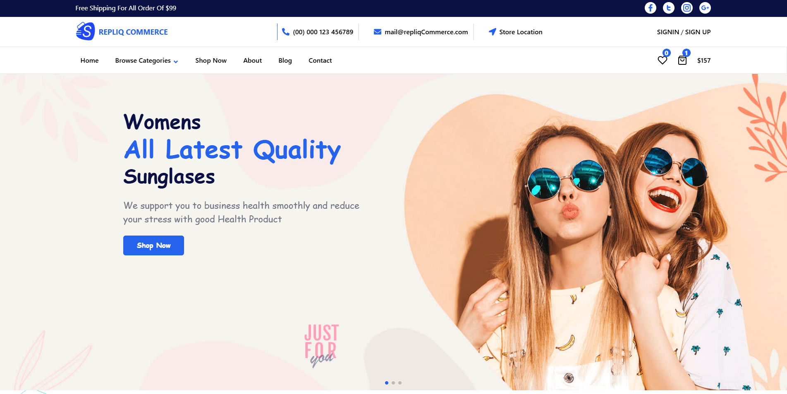

# 🛒 Repliq Commerce - E-commerce Platform

A modern, full-featured e-commerce platform built with React.js, offering a comprehensive shopping experience with an advanced admin dashboard for complete store management.

[](https://repliq-commerce.netlify.app/)
[](https://github.com/Ashraful2880/server-repliq-commerce)
[](LICENSE)

## 🌟 Features

### 🛍️ Customer Features
- **Product Catalog**: Browse products by categories (Men's, Women's, Kids, Backpacks)
- **Advanced Search & Filtering**: Find products quickly with sophisticated filtering options
- **Product Details**: Detailed product pages with images, descriptions, and ratings
- **Shopping Cart**: Add, remove, and manage items in cart with real-time updates
- **Wishlist**: Save favorite products for later purchase
- **User Authentication**: Secure signup, login, and profile management
- **Checkout Process**: Streamlined checkout with order confirmation
- **Order Tracking**: Track order status and history
- **Responsive Design**: Fully responsive across all devices
- **Interactive Sliders**: Product carousels and promotional banners

### 🎯 Homepage Sections
- **Hero Banner**: Eye-catching promotional banners
- **Shop by Category**: Quick category navigation
- **Featured Products**: Highlighted product collections
- **Best Sellers**: Top-selling items
- **New Arrivals**: Latest product additions
- **Top Trending**: Popular products
- **Testimonials**: Customer reviews and feedback
- **Newsletter Signup**: Stay updated with latest offers
- **Team Section**: Meet the team behind the platform
- **Blog Integration**: Latest news and articles

### 🔧 Admin Dashboard
- **Dashboard Overview**: Analytics and key metrics
- **Product Management**: 
  - Add new products
  - Edit existing products
  - View all products
  - Delete products
- **Order Management**:
  - View all orders
  - Update order status
  - Manage order details
- **Customer Management**:
  - View customer list
  - Add new customers
  - Customer details and history
- **User Management**: Manage user accounts and permissions
- **Admin Controls**: Make users admin
- **Reports & Analytics**: Sales summary and overview reports

## 🚀 Tech Stack

### Frontend
- **React.js 18** - Modern React with hooks
- **React Router DOM** - Client-side routing
- **Tailwind CSS** - Utility-first CSS framework
- **React Hook Form** - Form handling and validation
- **Axios** - HTTP client for API requests
- **React Icons** - Icon library
- **React Slick** - Carousel/slider component
- **Swiper.js** - Modern touch slider
- **React Rating** - Star rating component
- **React Paginate** - Pagination component
- **React Select** - Select input component
- **React Alert** - Notification system
- **React Scroll to Top** - Smooth scroll functionality

### Development Tools
- **Create React App** - React application setup
- **ESLint** - Code linting
- **Testing Library** - Testing utilities

## 📱 Screenshots

### Homepage


### Product Catalog


### Admin Dashboard


## 🛠️ Installation & Setup

### Prerequisites
- Node.js (v14 or higher)
- npm or yarn
- Git

### Local Development Setup

1. **Clone the repository**
   ```bash
   git clone https://github.com/Ashraful2880/client-repliq-commerce.git
   cd client-repliq-commerce
   ```

2. **Install dependencies**
   ```bash
   npm install
   # or
   yarn install
   ```

3. **Environment Configuration**
   
   Create a `.env` file in the root directory:
   ```env
   REACT_APP_API_PATH=your_backend_api_url
   ```

4. **Start the development server**
   ```bash
   npm start
   # or
   yarn start
   ```

5. **Open your browser**
   
   Navigate to `http://localhost:3000`

### Production Build

```bash
npm run build
# or
yarn build
```

## 🌐 Live Demo

**Frontend**: [https://repliq-commerce.netlify.app/](https://repliq-commerce.netlify.app/)

**Backend Repository**: [https://github.com/Ashraful2880/server-repliq-commerce](https://github.com/Ashraful2880/server-repliq-commerce)

## 📂 Project Structure

```
src/
├── Assets/
│   └── Images/           # Static images and assets
├── Components/
│   ├── Context/          # React Context for state management
│   ├── Pages/            # Page components
│   │   ├── Home/         # Homepage sections
│   │   ├── Shop/         # Product catalog and filtering
│   │   ├── Dashboard/    # Admin dashboard components
│   │   ├── CartOverview/ # Cart, checkout, and order pages
│   │   ├── Login/        # Authentication pages
│   │   └── ...
│   ├── Shared/           # Reusable components
│   │   ├── Navbar/       # Navigation components
│   │   ├── Footer/       # Footer component
│   │   └── ...
│   └── PrivateRoute/     # Protected route component
├── App.js                # Main app component
└── index.js              # App entry point
```

## 🔐 Authentication & Security

- Secure user authentication system
- Protected routes for admin dashboard
- JWT token-based authentication
- Private route protection for sensitive pages
- Role-based access control

## 📱 Responsive Design

- Mobile-first approach
- Fully responsive across all screen sizes
- Touch-friendly interface
- Optimized for various devices (phones, tablets, desktops)

## 🎨 UI/UX Features

- Modern and clean design
- Smooth animations and transitions
- Interactive elements
- User-friendly navigation
- Loading states and error handling
- Toast notifications for user feedback

## 📊 State Management

- React Context API for global state
- Local Storage integration for cart persistence
- Wishlist state management
- Real-time cart updates

## 🚀 Performance Optimizations

- Code splitting with React.lazy
- Optimized images and assets
- Efficient state management
- Minimal bundle size
- Fast loading times

## 🤝 Contributing

Contributions are welcome! Please feel free to submit a Pull Request.

1. Fork the project
2. Create your feature branch (`git checkout -b feature/AmazingFeature`)
3. Commit your changes (`git commit -m 'Add some AmazingFeature'`)
4. Push to the branch (`git push origin feature/AmazingFeature`)
5. Open a Pull Request

## 📝 License

This project is licensed under the MIT License - see the [LICENSE](LICENSE) file for details.

## 👨‍💻 Author

**Ashraful Islam**
- GitHub: [@Ashraful2880](https://github.com/Ashraful2880)
- LinkedIn: [Connect with me](https://linkedin.com/in/ashraful2880)

## 🙏 Acknowledgments

- React.js community for excellent documentation
- Tailwind CSS for the utility-first CSS framework
- All open-source contributors who made this project possible

---

⭐ **If you found this project helpful, please give it a star!** ⭐
